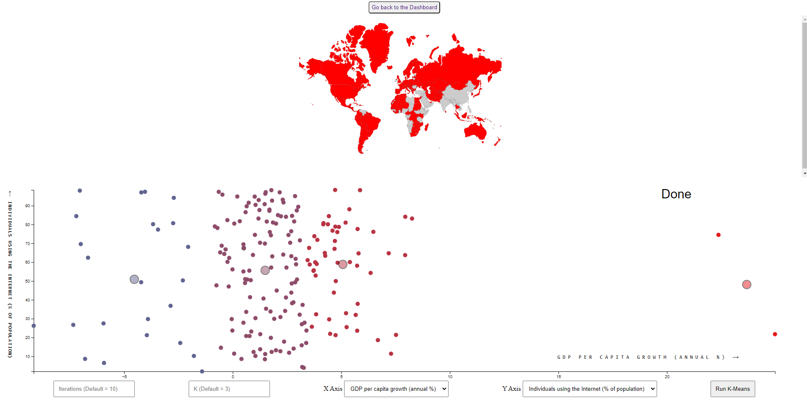
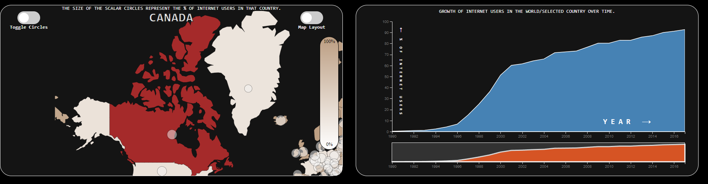

# F20DV_Lab4

- Name: Gaurav Gosain
- HWID: H00333519
- HW Username: gg68
- F20DV Lab 4 demonstrated to Dr Ryad Soobhany on 08/04/2022

# [Lab 4 (gaurav-gosain.github.io)](https://gaurav-gosain.github.io/F20DV_Lab4/)

---


<!-- TOC Here -->
- [F20DV_Lab4](#f20dv_lab4)
- [Lab 4 (gaurav-gosain.github.io)](#lab-4-gaurav-gosaingithubio)
  - [Part 1. Datasets](#part-1-datasets)
  - [Design Pattern Overview](#design-pattern-overview)
    - [Dashboard Layout](#dashboard-layout)
    - [Coding Style](#coding-style)
  - [Data Storytelling](#data-storytelling)
    - [What share of people are online?](#what-share-of-people-are-online)
    - [How many Internet users does each country have?](#how-many-internet-users-does-each-country-have)
    - [Broadband access](#broadband-access)
    - [Mobile phone use](#mobile-phone-use)
    - [The rise of social media](#the-rise-of-social-media)
  - [Conclusion](#conclusion)
  - [Future Work](#future-work)

---

## Part 1. Datasets

```
data
├── broadband-penetration-by-country.csv
├── daily-hours-spent-with-digital-media-per-adult-user.csv
├── daily-time-spent-on-the-internet-by-young-people.csv
├── gdp.csv
├── mobile-cellular-subscriptions-per-100-people.csv
├── number-of-internet-users-by-country.csv
├── percentage-of-young-people-engaging-in-social-networking-online.csv
├── share-of-individuals-using-the-internet.csv
├── technology-adoption-by-households-in-the-united-states.csv
├── users-by-social-media-platform.csv
└── world.geojson
```

This Lab required us to create a Custom Data Visualization & perform Analysis on datasets of our choice.

Since this lab came with no predefined requirements, the implementation was purely based on my own thought processes when trying to visualize and analyze this dataset. All implementations were done with careful consideration to how each of the charts deal with visualizing the datasets. In this case the visualization was done on the information of the internet. This dataset in particular was interesting to myself as it had quite a variety of information dealing with the internet.

A deeper look into the dataset would allow for understanding how fast the internet expanded with a multitude of information provided, an example being how the internet is accessed, how broadband is accessed, use of social media platforms, use of phones, etc. All this information when combined makes for a visually interesting story board which is the reason this dataset was chosen. Out of the multiple sub-datasets, only a few were selected to visualize which is shown above. 

Expanding on what each of the datasets mean;

broadband-penetration-by-country.csv - This dataset provided information on the access of people to broadband network per 100 persons. This in particular looks at the active subscription to fast and stable internet. This covers the different forms of data transfers, such as modem, Fiber internet, DSL, wired/satellite broadband.

daily-hours-spent-with-digital-media-per-adult-user.csv - This dataset looks at the use of social-media by adults in the United States, and is split into three different categories such as Mobile, Desktop and any other device used.

daily-time-spent-on-the-internet-by-young-people.csv - This dataset dwells into the time spent on the internet by a younger demographic across all countries.

gdp.csv - Gross Domestic Product (GDP), this dataset looks at the total amount of monetary value held by a country, it ranges across all countries over a time period. 

mobile-cellular-subscriptions-per-100-people.csv - The dataset looks at the growth of cellular subscriptions per 100 persons across all the countries, 

number-of-internet-users-by-country.csv - This dataset looks into the amount of users of the internet by country, the date ranges from 1990 to 2017 and takes into consideration the population of the country and their access to the internet.

percentage-of-young-people-engaging-in-social-networking-online.csv - This dataset checks the percentage of the younger demographic and their use of social networking.

share-of-individuals-using-the-internet.csv - The number of individuals using the internet over a time period, and whom has access to the internet.

technology-adoption-by-households-in-the-united-states.csv - How many houses adopted technology and used it within the United States. 

users-by-social-media-platform.csv - This dataset looks at how many users were on a platform at a given time, concurrent and maximum given the time period. This dataset includes social media both new and old and hence has data from different time intervals, such as the day the platform was released, some released during the 2000's, and others after 2010.

world.geojson - This dataset was used to create the map, it includes the location of each of the countries with co-ordinates to draw the paths, the county names and it's respective three-digit ISO code. 

---

## Design Pattern Overview

### Dashboard Layout

The layout of the main dashboard is as follows:

<div id="Q1" style='float:left;position:relative;background:blue;width: 50%;height: 200px;border-radius: 20px; display: flex; justify-content: center; align-items: center; color: black; font-weight: 800; font-family: monospace; font-size: 2em;text-align: center'>
MAP</div>
<div id="Q2" style='float:right;position:relative;background:green;width: 50%;height: 200px;border-radius: 20px; display: flex; justify-content: center; align-items: center; font-weight: 800; font-family: monospace; font-size: 2em;text-align: center; color: black'>Area Chart for Growth of Percentage of Internet Users over time</div>
<div id="Q3" style='float:left;position:relative;background:red;width: 50%;height: 200px;border-radius: 20px; display: flex; justify-content: center; align-items: center; font-weight: 800; font-family: monospace; font-size: 2em;text-align: center; color: black'>Line Chart for Growth of total Population using Internet over time</div>
<div id="Q4" style='float:right;position:relative;background:orange;width: 50%;height: 200px;border-radius: 20px; display: flex; justify-content: center; align-items: center; font-weight: 800; font-family: monospace; font-size: 2em; text-align: center; color: black'>Donut chart showing the % with and without internet access</div>
<div id="Q3" style='float:left;position:relative;background:purple;width: 50%;height: 200px;border-radius: 20px; display: flex; justify-content: center; align-items: center; font-weight: 800; font-family: monospace; font-size: 2em;text-align: center; color: black'>Line Chart showing number of Broadband Subscriptions / 100 People for selection</div>
<div id="Q4" style='float:right;position:relative;background:brown;width: 50%;height: 200px;border-radius: 20px; display: flex; justify-content: center; align-items: center; font-weight: 800; font-family: monospace; font-size: 2em; text-align: center; color: black'>Line Chart showing number of Cellular Subscriptions / 100 People for selection</div>
<div style='float:left;position:relative;background:violet;width: 100%;height: 200px;border-radius: 20px; display: flex; justify-content: center; align-items: center; font-weight: 800; font-family: monospace; font-size: 2em;text-align: center; color: black'>Bar Chart Race showing the Growth of different social media platforms over time</div>
<div style='float:right;position:relative;background:grey;width: 100%;height: 200px;border-radius: 20px; display: flex; justify-content: center; align-items: center; font-weight: 800; font-family: monospace; font-size: 2em; text-align: center; color: black'>Bar chart Race showing the share of US Households using specific technologies.</div>
<div style='float:right;position:relative;background:cyan;width: 100%;height: 200px;border-radius: 20px; display: flex; justify-content: center; align-items: center; font-weight: 800; font-family: monospace; font-size: 2em; text-align: center; color: black'>Bar Chart showing the share of the adult US population using different devices</div>
<div style='float:right;position:relative;background:pink;width: 100%;height: 200px;border-radius: 20px; display: flex; justify-content: center; align-items: center; font-weight: 800; font-family: monospace; font-size: 2em; text-align: center; color: black'>Bar Chart showing the share of people aged 16-24 engaging in social networking online across countries.</div>

I created a secondary dashboard just for the clustering analysis which has its layout as follows: 

<div style='float:left;position:relative;background:red;width: 100%;height: 200px;border-radius: 20px; display: flex; justify-content: center; align-items: center; font-weight: 800; font-family: monospace; font-size: 2em;text-align: center; color: black'>MAP</div>
<div style='float:right;position:relative;background:orange;width: 100%;height: 200px;border-radius: 20px; display: flex; justify-content: center; align-items: center; font-weight: 800; font-family: monospace; font-size: 2em; text-align: center; color: black'>Scatter Plot (Clustering)</div>

All layouts were constructed keeping the MVP principles in mind, each layout in the main dashboard is constructed and can be updated using a function. 

Encapsulation was done for different visual elements by using different functions to render different elements. The GUP (General Update Pattern) was used in places where it was necessary.

Similar to Lab 3, there are two toggles for the map, one to hide/show the scalar circles and another one to switch the projection of the map from Mercator to a globe.

### Coding Style

```
js
├── barChartRace.js
├── defaultLineGraph.js
├── drawMap.js
├── pieChart.js
└── updateLineGraph.js
```

The code for most of the graphs and visualizations are directly taken from the previous lab and modified slightly to fit the requirements of this lab and the data.

For an in-depth explanation of the code, refer to the previous lab.

All the code was written in the ES6 syntax and uses the d3.js library (Version 7) for visualizations. The code was written to be as modular and extensible as possible. Most of the basic graphs are encapsulated into functions and follow the MVP principles where each graph can be drawn and updated using the various drawing/updating functions corresponding to that graph.

The main `dashboard` for this Lab contained `6 major layouts` with a `map` on the top left, an `area chart`, `three line charts` and a `Donut chart`.

Bar graphs are used to compare things between different groups or to track changes over time. However, when trying to measure change over time, bar graphs are best when the changes are larger.

This choice of going with representing the data with the help of line charts and area charts was crucial and was made since Line charts are usually easily interpretable and convey the information to the user clearly. Line charts were also chosen since they are a good choice to show data over a certain time range and two dimensional data.

The donut chart is really good at showing the distribution of a value where each slice(arc) of the donut chart represents a subset of the data and all slices together add up to a 100% of the chosen data.


On clicking any country on the map, all the other charts get updated based on data filtered for the selected country.

All the scales automatically transition smoothly and the axes are updated with the new scales. There are d3 transition animations applied to each component in the dashboard so that it doesn't appear as if the data suddenly changes and it makes it clear to the user how and where the data is being filtered/updated.

The dashboard layout is very similar to the dashboard layout explained in lab 3 which is why I will not go into much details about the functionality of the dashboard.

`barChartRace.js` : 

```js
/**
 * This function is used to render and update the bar chart races
 * @param {*} svg_race SVG element to render the bar chart on
 * @param {*} value 
 * @param {*} years 
 * @param {*} heading 
 * @param {*} csv_path 
 * @param {*} tickDuration 
 */
const restart = (
  svg_race,
  value,
  years,
  heading = "Growth of Social Media Platforms over the time",
  csv_path = "data/users-by-social-media-platform.csv",
  tickDuration = 1500
) => {
  svg_race.selectAll("*").remove();

  (w = document.getElementsByClassName("bar_chart_race")[0].clientWidth - 30),
    (h =
      document.getElementsByClassName("bar_chart_race")[0].clientHeight - 30);

  svg_race.attr("width", w).attr("height", h);

  var ticker;

  var top_n = 12;
  var height = h;
  var width = w;

  const margin = {
    top: 80,
    right: 50,
    bottom: 5,
    left: 0,
  };

  let barPadding = (height - (margin.bottom + margin.top)) / (top_n * 5);

  let title = svg_race
    .append("text")
    .attr("class", "title")
    .attr("y", 24)
    .attr("x", w / 2)
    .styles({
      "alignment-baseline": "middle",
      "text-anchor": "middle",
    })
    .html(heading);

  let year = years[0];

  d3.csv(csv_path).then(function (data) {

    data.forEach((d, i) => {
      (d.value = +d[value]),
        (d.lastValue = i == 0 ? 10000 : +data[i - 1][value]),
        (d.year = +d.Year),
        (d.value = d.value > 0 ? d.value : 0),
        (d.colour = d3.hsl(Math.random() * 360, 0.75, 0.75));
    });

    let yearSlice = data
      .filter((d) => d.year == year && !isNaN(d.value))
      .sort((a, b) => b.value - a.value)
      .slice(0, top_n);

    yearSlice.forEach((d, i) => (d.rank = i));

    console.log("yearSlice: ", yearSlice);

    let x = d3
      .scaleLinear()
      .domain([0, d3.max(yearSlice, (d) => d.value)])
      .range([margin.left, width - margin.right - 65]);

    let y = d3
      .scaleLinear()
      .domain([top_n, 0])
      .range([height - margin.bottom, margin.top]);

    let xAxis = d3
      .axisTop()
      .scale(x)
      .ticks(width > 500 ? 5 : 2)
      .tickSize(-(height - margin.top - margin.bottom))
      .tickFormat((d) => d3.format(",")(d));

    svg_race
      .append("g")
      .attr("class", "axis xAxis")
      .attr("transform", `translate(0, ${margin.top})`)
      .call(xAxis)
      .selectAll(".tick line")
      .classed("origin", (d) => d == 0);

    svg_race
      .selectAll("rect.bar")
      .data(yearSlice, (d) => d.Entity)
      .enter()
      .append("rect")
      .attr("class", "bar")
      .attr("rx", 20)
      .attr("x", x(0) + 1)
      .attr("width", (d) => x(d.value) - x(0) - 1)
      .attr("y", (d) => y(d.rank) + 5)
      .attr("height", y(1) - y(0) - barPadding)
      .style("fill", (d) => d.colour);

    svg_race
      .selectAll("text.label")
      .data(yearSlice, (d) => d.Entity)
      .enter()
      .append("text")
      .attr("class", "label")
      .attr("x", (d) => x(d.value) - 8)
      .attr("y", (d) => y(d.rank) + 5 + (y(1) - y(0)) / 2 + 1)
      .style("text-anchor", "end")
      .html((d) => d.Entity);

    let yearText = svg_race
      .append("text")
      .attr("class", "yearText")
      .attr("x", width - margin.right)
      .attr("y", height - 25)
      .style("text-anchor", "end")
      .html(~~year)
      .call(halo, 10);

    ticker = d3.interval((e) => {
      yearSlice = data
        .filter((d) => d.year == year && !isNaN(d.value))
        .sort((a, b) => b.value - a.value)
        .slice(0, top_n);

      yearSlice.forEach((d, i) => (d.rank = i));

      x.domain([0, d3.max(yearSlice, (d) => d.value)]);

      svg_race
        .select(".xAxis")
        .transition()
        .duration(tickDuration)
        .ease(d3.easeLinear)
        .call(xAxis);

      let bars = svg_race.selectAll(".bar").data(yearSlice, (d) => d.Entity);

      bars
        .enter()
        .append("rect")
        .attr("rx", 20)
        .attr("class", (d) => `bar ${d.Entity.replace(/\s/g, "_")}`)
        .attr("x", x(0) + 1)
        .attr("width", (d) => x(d.value) - x(0) - 1)
        .attr("y", (d) => y(top_n + 1) + 5)
        .attr("height", y(1) - y(0) - barPadding)
        .style("fill", (d) => d.colour)
        .transition()
        .duration(tickDuration)
        .ease(d3.easeLinear)
        .attr("y", (d) => y(d.rank) + 5);

      bars
        .transition()
        .duration(tickDuration)
        .ease(d3.easeLinear)
        .attr("width", (d) => x(d.value) - x(0) - 1)
        .attr("y", (d) => y(d.rank) + 5);

      bars
        .exit()
        .transition()
        .duration(tickDuration)
        .ease(d3.easeLinear)
        .attr("width", (d) => x(d.value) - x(0) - 1)
        .attr("y", (d) => y(top_n + 1) + 5)
        .remove();

      let labels = svg_race
        .selectAll(".label")
        .data(yearSlice, (d) => d.Entity);

      labels
        .enter()
        .append("text")
        .attr("class", "label")
        .attr("x", (d) => x(d.value) - 8)
        .attr("y", (d) => y(top_n + 1) + 5 + (y(1) - y(0)) / 2)
        .style("text-anchor", "end")
        .html((d) => d.Entity)
        .transition()
        .duration(tickDuration)
        .ease(d3.easeLinear)
        .attr("y", (d) => y(d.rank) + 5 + (y(1) - y(0)) / 2 + 1);

      labels
        .transition()
        .duration(tickDuration)
        .ease(d3.easeLinear)
        .attr("x", (d) => x(d.value) - 8)
        .attr("y", (d) => y(d.rank) + 5 + (y(1) - y(0)) / 2 + 1);

      labels
        .exit()
        .transition()
        .duration(tickDuration)
        .ease(d3.easeLinear)
        .attr("x", (d) => x(d.value) - 8)
        .attr("y", (d) => y(top_n + 1) + 5)
        .remove();

      let valueLabels = svg_race
        .selectAll(".valueLabel")
        .data(yearSlice, (d) => d.Entity);

      valueLabels
        .enter()
        .append("text")
        .attr("class", "valueLabel")
        .attr("x", (d) => x(d.value) + 5)
        .attr("y", (d) => y(top_n + 1) + 5)
        .text((d) => d3.format(",.0f")(d.lastValue))
        .transition()
        .duration(tickDuration)
        .ease(d3.easeLinear)
        .attr("y", (d) => y(d.rank) + 5 + (y(1) - y(0)) / 2 + 1);

      valueLabels
        .transition()
        .duration(tickDuration)
        .ease(d3.easeLinear)
        .attr("x", (d) => x(d.value) + 5)
        .attr("y", (d) => y(d.rank) + 5 + (y(1) - y(0)) / 2 + 1)
        .tween("text", function (d) {
          let i = d3.interpolateRound(d.lastValue, d.value);
          return function (t) {
            this.textContent = d3.format(",")(i(t));
          };
        });

      valueLabels
        .exit()
        .transition()
        .duration(tickDuration)
        .ease(d3.easeLinear)
        .attr("x", (d) => x(d.value) + 5)
        .attr("y", (d) => y(top_n + 1) + 5)
        .remove();

      yearText.html(~~year);

      if (year == years[1]) ticker.stop();
      year = d3.format(".1f")(+year + 1);
    }, tickDuration);
  });

  const halo = function (text, strokeWidth) {
    text
      .select(function () {
        return this.parentNode.insertBefore(this.cloneNode(true), this);
      })
      .style("fill", "#ffffff")
      .style("stroke", "#ffffff")
      .style("stroke-width", strokeWidth)
      .style("stroke-linejoin", "round")
      .style("opacity", 1);
  };
};
```

The above code is used to animate the bar chart race. The basic logic behind animating the bar chart is using a ticker an using d3's interval function to basically recalculate and update the positions of the bars after a set interval of time.

```js
restart(race_svg, 'Monthly active users (Statista and TNW (2019))', [2002, 2018]); // Call the first bar chart race

restart(bar_chart_svg,
    'Technology Diffusion (Comin and Hobijn (2004) and others)',
    [1980, 2019],
    heading = 'Share of US households using specific technologies, 1915 to 2019',
    csv_path = 'data/technology-adoption-by-households-in-the-united-states.csv',
    tickDuration = 800) // Call the second bar chart race
```

The above code is used to start drawing the two bar chart races, the code is made in a modular way such that multiple instances of the graph can be drawn independently on different SVGs with their own data.


```js
d3.csv("data/daily-hours-spent-with-digital-media-per-adult-user.csv").then(async function (data) {
    // make a bar chart

    const exercise20 = () => {
        const mainDiv = d3.select('.bar_chart').styles({
            display: "flex",
            "justify-content": "center",
            "align-items": "center",
            "flex-direction": "column",
        });
        const buttonsDiv = mainDiv.append("div").styles({
            width: "50%",
            display: "flex",
            "justify-content": "space-evenly",
        });

        var dataLabels = ['Mobile (BOND Internet Trends (2019))',
            'Desktop/Laptop (BOND Internet Trends (2019))',
            'Other Connected Devices (BOND Internet Trends (2019))']

        var buttonLabels = ['Mobile',
            'Desktop/Laptop',
            'Other Connected Devices']

        var data1 = data.map((d, i) => {
            return {
                "group": d['Year'],
                "value": d[dataLabels[0]]
            }
        });

        var data2 = data.map((d, i) => {
            return {
                "group": d['Year'],
                "value": d[dataLabels[1]]
            }
        });

        var data3 = data.map((d, i) => {
            return {
                "group": d['Year'],
                "value": d[dataLabels[2]]
            }
        });

        const colorFunctions = [
            d3
                .scaleLinear()
                .interpolate(d3.interpolateHcl)
                .domain([
                    d3.min(data1, function (d) {
                        return d.value;
                    }),
                    d3.max(data1, function (d) {
                        return d.value;
                    }),
                ])
                .range(["blue", "red"]),
            d3
                .scaleLinear()
                .interpolate(d3.interpolateHcl)
                .domain([
                    d3.min(data2, function (d) {
                        return d.value;
                    }),
                    d3.max(data2, function (d) {
                        return d.value;
                    }),
                ])
                .range(["orange", "purple"]),
            d3
                .scaleLinear()
                .interpolate(d3.interpolateHcl)
                .domain([
                    d3.min(data3, function (d) {
                        return d.value;
                    }),
                    d3.max(data3, function (d) {
                        return d.value;
                    }),
                ])
                .range(["violet", "green"]),
        ];

        [data1, data2, data3].map((data, i) => {
            buttonsDiv
                .append("button")
                .on("click", () => {
                    update(data, i);
                })
                .text(buttonLabels[i]);
        });

        // set the dimensions and margins of the graph
        const margin = { top: 30, right: 30, bottom: 120, left: 60 };
        const width =
            document.getElementsByClassName("bar_chart")[0].clientWidth - margin.left - margin.right;
        const height =
            document.getElementsByClassName("bar_chart")[0].clientHeight - margin.top - margin.bottom;

        // append the svg object to the body of the page
        var svg = mainDiv
            .append("svg")
            .attr("width", width + margin.left + margin.right)
            .attr("height", height + margin.top + margin.bottom)
            .append("g")
            .attr("transform", "translate(" + margin.left + "," + margin.top + ")");

        // X axis
        var x = d3
            .scaleBand()
            .range([0, width])
            .domain(
                data1.map(function (d) {
                    return d.group;
                })
            )
            .padding(0.2);

        // Add Y axis
        var y = d3.scaleLinear().domain([0, 25]).range([height, 0]);

        svg
            .append("g")
            .attr("transform", "translate(0," + height + ")")
            .attr("class", "bottomAxis")
            .call(d3.axisBottom(x));

        svg.append("g").attr("class", "leftAxis").call(d3.axisLeft(y));

        // A function that create / update the plot for a given variable:
        function update(data, i) {
            // X axis
            x = d3
                .scaleBand()
                .range([0, width])
                .domain(
                    data.map(function (d) {
                        return d.group;
                    })
                )
                .padding(0.2);

            // Add Y axis
            y = d3
                .scaleLinear()
                .domain([
                    0,
                    d3.max(data, function (d) {
                        return d.value;
                    }) + 5,
                ])
                .range([height, 0]);

            svg
                .selectAll(".bottomAxis")
                .transition()
                .duration(1000)
                .call(d3.axisBottom(x));

            svg.selectAll(".leftAxis").transition().duration(1000).call(d3.axisLeft(y));

            var u = svg.selectAll("rect").data(data);
            u.enter()
                .append("rect")
                .on("mouseover", onMouseOver)
                .on("mouseout", onMouseOut)
                .merge(u)
                .transition()
                .duration(1000)
                .attr("x", function (d) {
                    return x(d.group);
                })
                .attr("y", function (d) {
                    return y(d.value);
                })
                .attr("width", x.bandwidth())
                .attr("height", function (d) {
                    return height - y(d.value);
                })
                .attr("fill", (d) => colorFunctions[i](d.value))
                .attr("rx", "20px");

            u.exit()
                .transition()
                .duration(1000)
                .attr("y", height)
                .attr("height", 0)
                .style("opacity", 0)
                .remove();
        }

        //mouseover event handler function
        function onMouseOver(event, d) {
            d3.selectAll("rect").style("opacity", 0.5);

            d3.select(this)
                .style("opacity", 1)
                .transition() // adds animation
                .duration(400)
                .attrs({
                    width: x.bandwidth() + 5,
                    y: (d) => y(d.value) - 10,
                    height: (d) => height - y(d.value) + 10,
                    x: (d) => x(d.group) - 2.5,
                    stroke: "black",
                    "stroke-width": "3px",
                    rx: "25px",
                    cursor: "pointer",
                });

            svg
                .append("text")
                .attrs({
                    class: "val",
                    x: x(d.group) + x.bandwidth() / 2,
                    y: 0,
                })
                .styles({
                    "font-size": "1em",
                    "font-weight": "bold",
                    "font-family": "monospace",
                    "text-transform": "uppercase",
                    "text-anchor": "middle",
                })
                .transition()
                .duration(800)
                .ease(d3.easeBounce)
                .attrs({
                    y: y(d.value) - 25,
                })
                .text(d.group + " ⟶ " + d.value); // Value of the text
        }

        //mouseout event handler function
        function onMouseOut(event, d) {
            d3.select(this)
                .transition() // adds animation
                .duration(400)
                .attrs({
                    stroke: "none",
                    "stroke-width": "0px",
                    width: x.bandwidth(),
                    y: y(d.value),
                    height: height - y(d.value),
                    x: x(d.group),
                    rx: "20px",
                });

            d3.selectAll("rect").style("opacity", 1);

            d3.selectAll(".val").remove();
        }

        // Initialize the plot with the first dataset
        update(data1, 0);
    };

    exercise20();
})

```

The above code is very similar to the code from Lab 2 to plot bar charts, the only difference is its been modified slightly in order to work with my current datasets.

The above code produces the following (versions of) bar charts:


A similar version of the above code was modified to get the following plot:


Finally, I even added a small interactive page to play around with k-means clustering.

The algorithm for k-means clustering was written from scratch including calculating the centroids and the distance between the centroids.

A world map was also used to show what each point is located in. An event listener for `mouseover` over the `centroids` for the plot for clustering was added. 

This event listener works in a way such that when a user hovers over a centroid, all the countries that fall in that centroid get highlighted on another chart which is the world map. A centroid can be easily distinguished from the normal points on the scatter plot by just looking at the radius of the point. Centroids have a much bigger radius than the normal points in my implementation and are easy to identify.



For example the above image was captured on hover of the second centroid.

[Note: The screen capturing tool used to capture the above image did not include the mouse pointer hence it is a bit hard to show exactly where the mouse pointer was when capturing the image]

In the above figure, upon hovering over the purple centroid (2nd centroid from the left), all the countries associated to that centroid get highlighted on the map.

As soon as the mouse stops hovering over the given centroid, the highlighted countries turn back to the default color.

The clustering scatter plot also implemented cross layout brushing in a way such that brushing over multiple points in the scatter plot highlights the corresponding countries in the map.


I used the k-Means algorithm to cluster my data into multiple clusters.

The algorithm for k-Means was written from scratch by me. My implementation initializes 'k' number of centroids randomly in the search space and then assign points to the centroids based on the euclidean distances of the point to its closest centroid.

The points allocated to a centroid are distinguished by the color of the point, the centroids themselves look like points of the same color but with a much larger radius and are translucent.

The k-Means algorithm runs for 'n' iterations which can be specified in the function call.

I plotted `GDP per capita growth (annual %)` against `Individuals using the Internet (% of population)` for each country in the dataset.


As it can be seen above, the clustering page is more of a playground where a user can select the iterations he want to run the k-means algorithm for as well as select the number of clusters he wants to see.

The map and the clustering scatter plot were made bidirectional in a way that when hovering over or clicking a country on the map, the corresponding point representing that country in the scatter plot gets highlighted.

---
## Data Storytelling

The main goal of the visualizations done for this lab was to answer a few questions I set for myself before starting any visualizations and to see how the data can be used to answer those questions. The following are the questions I set for myself and what I inferred from the data:
### What share of people are online?


The above map shows the share/percentage of the population that is accessing the internet for all countries of the world. Internet users according to the definition given in the dataset are individuals who have used the Internet (from any location) in the last 3 months. The Internet can be used via a computer, mobile phone, etc.

In richer countries more than two thirds of the population are typically online. And although usage rates are much lower in the developing world, they are increasing.


The above area chart shows the growth of te internet users in teh entire world over time. It is fascinating to see that even up until the year 2017, only about half of the world's population was online.



The above graph shows how Canada, a country with a high GDP, has grown in terms of internet users over time and has over 90% of the population online.


Whereas in Nepal, where the GDP is relatively low, the population is only about 21% online, the growth of internet users is very slow.

### How many Internet users does each country have?

The Internet has been one of our most revolutionary and extremely fast-growing technologies. Globally, the number of people online increased from only about 413 million in 2000 to over 3.4 billion in 2016. The one-billion barrier was crossed in 2005. Every day over the past five years, an average of 640,000 people went online for the first time.

The number of people that are online increased from 1,992,063,360 in 2010 to 3,408,270,592 in 2016.

This is an increase of 3,408,270,592-1,992,063,360=1,416,207,232 over 6 years.

On average this means that (1,416,207,232/6)/365=646,670 people were online for the first time on an average day in these last 6 years. This was 646,670/24=26,945 new people online every hour.

But how many people from each country are online? In the maps, we see the total number of users by country, and the percentage of a country’s population who are users.

China and India take the top two slots despite having only 50 and 26 percent online, respectively. The top six countries by users (and the only countries with over 100 million) in 2016/17 were:

- China = 765 million
- India = 391 million
- United States = 245 million
- Brazil = 126 million
- Japan = 116 million
- Russia = 109 million


The Internet has been growing at an incredible rate; many countries – including India, Bangladesh, Ghana and Malawi – have doubled the number of users in the last 3 years alone.

Around half of the world is not yet online, the internet’s history has only just begun, but with 27,000 new users every hour, many will experience it for the first time soon.

The visualizations are made in a way in which a user can explore and discover new patterns in the data. Clicking on a country on the map updates all the line charts, the area chart as well as the donut chart.

This opens up a new perspective on the data and allows the user to see how the data is used to answer the questions.

### Broadband access


This chart shows the number of fixed broadband subscriptions per 100 people.

This refers to fixed subscriptions to high-speed access to the public Internet (a TCP/IP connection), at downstream speeds equal to, or greater than, 256 kbit/s.

Means of connection include cable modem, DSL, fiber-to-the-home, other fixed (wired)-broadband subscriptions, satellite broadband and terrestrial fixed wireless broadband. Excluded are subscriptions via mobile-cellular networks.

The dashboard allows for users to select any country from the world map and this line chart corresponding to that country will be filtered and updated.

The observations for this chart are similar to the ones for the other charts wherein the richer countries tend to have higher broadband access whereas relatively poorer countries have lower broadband access.

Since the data gets filtered the user can explore the data in a way that is more meaningful.

Some key observations from experimenting with the data were that countries like South Korea and Germany had a higher broadband access than the rest of the world (around 41) and developing countries like Egypt and Pakistan had lower broadband access than the rest of the world.

### Mobile phone use

Similar to the previous chart, this chart shows the percentage of mobile cellular subscribers per 100 people.

A truly disruptive technological development has been the rise of mobile phones. The interactive visualization shows the latest global data.

By exploring the different chart views (by selecting different countries) you can see that globally one can see a very slow rise until the late 1990s and then a dramatically faster increase in mobile device subscriptions since the beginning of the 21st century.


### The rise of social media

Facebook is the most used social media platform, with a maximum of 2.4 Billion users on its platform. Aside from Facebook, Youtube is another competitor with 1 Billion users. In perspective, Facebook owns Whatsapp which also has another 1 Billion users, and this adds up to nearly 3.4 Billion users who are using social media on a daily basis. Nearly 2/3 of the worlds population is internet users, comparing the current world population of 7.9 Billion people to 3.4 Billion users.

Social Media has its own effects on the world, the different types of technologies and how its changed can be seen on people try to adopt these changes, tons of support is there for different things, and access to never seen before information in the palm of your hand is available to the general public at any given moment.

The dashboard visualizes the different social medias users and the largest social media platforms. By viewing the rise of trends and looking at the adoption of social media in relation to the development of modern-day technology, we can outline different conclusions of the correlation.

Social Media platforms started with MySpace in the early 2000's, when it achieved a million concurrent users in 2004. Using a bar chart it is possible to see the correlation of social media use over time.


The basic code for the race bar chart is borrowed from [bar chart races - bl.ocks.org](https://bl.ocks.org/jrzief/70f1f8a5d066a286da3a1e699823470f) which was originally written in version 5 of d3 but was updated to work with the most recent version of d3 (version 7) and updated in order to work with my datasets.

Additionally a button to restart the animation (race) was added which restarts the bar chart race.

The chart shows multiple different social media platforms, both new and old, that have been used by a different group of social media users over time. Older sites such as Facebook or Reddit have been around for years building up communities, newer platforms such as TikTok saw a peak of 1 Billion users over a 2 year time from from 2016 to 2018. Most older platforms had seen its demise with the introduction to newer, modern day social media platforms. Users either migrated to new platforms, or tried to keep the older ones surviving, once Social Media giant MySpace disappeared after the introduction to newer competitors with much better features. 

Platforms always try to adapt to their competitors by matching features alike, Twitter started as a text based Social Media platform which then moved to Images and Uploading Videos. With the Introduction of Vine by twitter being the basis for multiple different platforms such as TikTok, Instagram Reels, Facebook Shorts, or disappearing messages like Snapchat being adapted to all platforms as well. 

The Number of users using social media from 2005 to 2019 are based on the concurrent users, typically platforms use MAUs, which is Monthly Active Users, to calculate how many users are over a monthly period. Platforms ranged from 2.3 Billion on Facebook to platforms such as Youtube having a Billion Users.

Different Demographics have different preferences, this sees different age groups using different social media platforms. In general, the younger generation is more likely to use social media platforms to older people. Platforms such as Snapchat and Instagram, which depreciate more with usage over the age increment. Newer platforms are harder to gauge in relative to aging due to how recent they came out, this means that the older the current user base gets, the more likely the shift in age range occurs.


The number of US adults on social media increased significantly over the past two decades. The spread of social media throughout the world can be seen with the platforms prominence across the different countries. Comparing the different hardware used to access social media, the growth of the use social is relative to the access of computers, smartphones and the internet.

Social media went from being used by 1 Million people on MySpace to nearly 2/3 of the world's population over a decade, the boom in social media was unprecedented and would not be seen over a decade ago. The following bar chart shows the different technologies used in a US household over time.


The above graph shows the number of hours spent by a user in a day with different social media platforms per adult in the US.

The above graph shows the use of cellular devices over a given time frame, the below graphs show the use of desktops, laptops or other devices as well.


The past decade as seen a large increment in social media, this leads to a direct correlation of the increase in the amount of time an individual spends being online. For example, the US alone sees adults spend around six hours a day on any digital medium. As the below chart shoes the growth has been mainly affected by portable hand-held devices.

Another graph shows the proportion of people below the age of 25 spending time on social media. In Particular the age range of 16 to 24.


---
## Conclusion

This report explains the architecture of the dashboard and the different components of the dashboard. It also explains the different layouts and the different components of the layouts. It also explains the different components of the dashboard and how they are connected to each other.

I also answer how the queries are fulfilled along with the requirements.

The key takeaway from this exercise was the use of a simple and intuitive interface. The dashboard is designed to be intuitive and easy to use. It is easy to explore the evolution of internet across different places and different timelines with the help of the map combined with the line charts. The clustering analysis helps realize how the data is distributed across the world. The dashboard is also designed to be interactive and allow for the user to explore the data in a way that is more meaningful.

---
## Future Work

There is a lot of work that can be done to improvise the overall experience of using this application. A few of the notable changes that could be made would be to add tooltips to the line charts and the area chart to help determine what the data represents. I had another idea of using a "bubble" chart which helps represent 3 dimensions of data at once instead of the two dimensions currently being represented by the line charts. This bubble chart idea could not be implemented due to time limitations and other commitments.

The UI for the clustering chart could be worked on to make it more intuitive and easy to use. The clustering analysis could be improved to make it more accurate and to make it more useful.

Combining the two dashboards could be done to show the evolution of internet across the world. The two dashboards could be combined to show the evolution of internet in different countries.

Another improvement that can be made could be on the convergence method in the k-means algorithm, this could be done by using the distance between the centroids and the data points to determine the convergence.

---